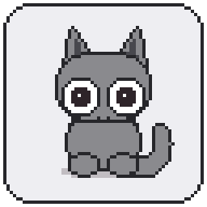
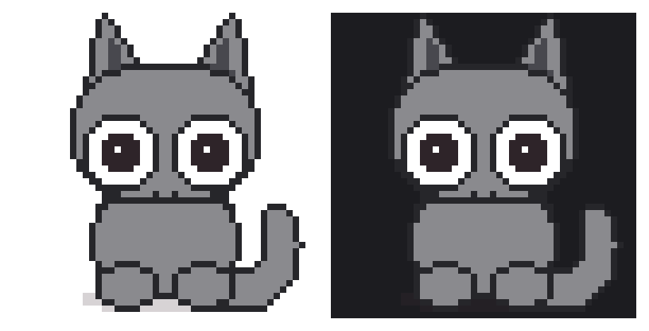

<div align="center">



# loafcat

**A pixel cat that lives on your desktop, watches your cursor, reacts to your
typing, and knows when Claude Code has finished working.**

macOS 13+ (Swift/AppKit) · Windows 10 1809+ (C#/Win32) · MIT licensed ·
**asks for zero permissions**

</div>

---

## Install

**macOS**

```sh
curl -fsSL https://raw.githubusercontent.com/aadisaraf/loafcat/main/install.sh | bash
```

**Windows**

```powershell
irm https://raw.githubusercontent.com/aadisaraf/loafcat/main/install.ps1 | iex
```

That's it — it installs to `/Applications` and starts. **No blocked-app dialog,
no trip through System Settings.**

<details>
<summary>Why the one-liner avoids the Gatekeeper dialog, and why that isn't a trick</summary>

macOS attaches its `com.apple.quarantine` flag based on **what downloaded the
file**. Browsers attach one; `curl` does not. So an app installed by the script
is never quarantined in the first place and simply opens.

Gatekeeper's question is *"did a human deliberately choose to run this?"*, and
typing an install command is a clearer yes than clicking through a warning. It's
the same reason Homebrew and rustup work this way.

What you're trusting is [`install.sh`](install.sh). It's short on purpose. Read
it first if you like — that's the point of it being one readable file:

```sh
curl -fsSL https://raw.githubusercontent.com/aadisaraf/loafcat/main/install.sh -o install.sh
less install.sh
bash install.sh
```

It verifies the release checksum before it copies anything, and never asks for
`sudo`.
</details>

To remove it: `… | bash -s -- --uninstall` (add `--purge` to drop settings too).

### Or download the disk image

Grab **`loafcat-<version>.dmg`** from
[Releases](https://github.com/aadisaraf/loafcat/releases/latest) and drag loafcat
onto Applications.

**A browser download will be blocked on first launch.** loafcat is not notarised
— that needs Apple's $99/year Developer Program — so macOS treats it as an app it
has never seen. Nothing is wrong with the download.

1. Double-click loafcat in Applications. macOS refuses and offers **Done**. Click it.
2. Open **System Settings → Privacy & Security** and scroll down.
3. Next to *"loafcat was blocked…"*, click **Open Anyway** and confirm.

Or in a terminal, equivalently: `xattr -dr com.apple.quarantine /Applications/LoafCat.app`

> Don't want to trust a stranger's binary at all? Fair —
> [build it yourself](#building-from-source). Five seconds, and nothing but the
> Xcode command line tools.

### On Windows

The same reasoning, mirrored. Windows attaches its *mark of the web* based on what
downloaded the file; browsers do, `Invoke-WebRequest` does not — so an app installed by
`install.ps1` simply opens, and a browser download shows **"Windows protected your PC"**
(**More info → Run anyway**) because loafcat is not code-signed.

It installs per-user under `%LOCALAPPDATA%\Programs\loafcat`, adds a Start Menu entry,
and never asks for administrator. The cat lives in the notification area — if you can't
see it, drag it out of the `^` overflow, which is where Windows hides new tray icons.
Left-click for Settings, right-click for the menu.

Everything below applies to both platforms unless it says otherwise.
[`windows/README.md`](windows/README.md) covers what is genuinely different and why —
including the one place Windows is simply better (click-through is free and exact there,
where macOS needs a 120Hz poll to reach 97%) and the one place it needs more work
(keystroke *counts* have to be inferred from a tick counter rather than read).

### Turning it on and off

**Open loafcat and the cat is on.** From Spotlight, from Applications, from the
Dock — opening it turns the cat on whether or not it was already running.

To turn it off, use the menu bar cat or the switch at the top of Settings. Off
really is off: nothing animates, no timer fires. loafcat stays in the menu bar,
so opening the app again turns it straight back on. **Quit** is separate, and is
also in that menu.

There's no Dock icon by default, because a menu bar pet has no business taking a
Dock slot. Turn on **Show loafcat in the Dock** in Settings if you'd rather reach
it like any other app; clicking the Dock icon then opens Settings.

Turn on **Open loafcat at login** and you never have to think about any of this
again.

---

## What it does

| | |
|---|---|
| **Watches your cursor** | Pupils, eyes, head and body track it on four layers, so the turn has depth instead of the whole cat sliding. |
| **Reacts to typing** | Kneads while you type, and overheats — steam and all — when you type fast. |
| **Picks up and stretches** | Drag it around; it hangs, stretches on a yank, and settles. Three feels, from Subtle to Springy. |
| **Purrs when petted** | Stroke it, and it leans into the cursor. It ignores a cursor that's merely parked on it. |
| **Hunts** | Fast, reversing cursor movement gets a pounce. |
| **Knows about Claude Code** | Thinks while a request runs, hops when it finishes, raises an alert when Claude needs you. Optional, reversible, and it cannot slow a session down. |
| **Looks after you** | Optional stretch breaks, hydration nudges, a pomodoro timer, a daily reminder and a pinned note — all off or conservative by default. |
| **Sleeps** | Goes quiet when you do. |

Three cats ship: **mono**, **cream** and **tuxedo**.

<div align="center">

</div>

---

## Privacy: it asks for nothing

**macOS:** no Accessibility, no Input Monitoring, no Screen Recording, no prompts
at all. **Windows:** no elevation prompt, no keyboard hook, no manifest capability.

Typing reactions on macOS come from `CGEventSource.counterForEventType`, which returns
an integer count of key events. Not which keys — *how many*.

Windows has no equivalent, so the same guarantee is rebuilt from two APIs that each
individually cannot leak anything: `GetLastInputInfo`, whose entire payload is a tick
count of the last input event of any kind, and a **mouse-only** hook, whose callback
receives a structure with no field capable of carrying a keystroke. A keystroke is then
*inferred* — the input tick moved, and it is not the tick the mouse fired on. The app
learns that *a* key was pressed and when. It cannot learn which, because neither API it
called was ever told. That is strictly **less** information than the Mac gets.

Either way, there is no code path by which a keycode could reach this app, so being
unable to read what you type is **structural**, not a promise you have to take on trust.

This is enforced mechanically, not by review: `scripts/check-privacy.sh` fails the
build if code appears that would trigger a permission prompt or read key identity —
event taps and global keyboard monitors on macOS; `WH_KEYBOARD_LL`, `GetAsyncKeyState`,
`GetKeyState`, raw input, journal hooks, `SendInput`, window titles and screen capture
on Windows. It scans Swift, C#, PowerShell, Python and shell, and runs on every build
and in CI.

Most desktop pets use `uiohook` or a `CGEventTap`. Those are *active filters* that
can read and suppress every keystroke system-wide, which is why they trigger the
"control your computer" dialog. loafcat will never have one.

---

## Claude Code integration

Settings → Claude Code → **Connect**. This adds hook entries to
`~/.claude/settings.json` (backing up the previous file first) and copies the hook
script to `~/.loafcat/`. Disconnecting removes only loafcat's entries.

Every hook is **asynchronous**, carries a short explicit timeout, uses a sub-second
network timeout and **exits zero whatever happens** — so it cannot stall a Claude
Code session, even with loafcat quit. Nothing is hooked into message display.

The cat talks to itself over `127.0.0.1` on a random port, behind a bearer token
written to `~/.loafcat/endpoint.json` — mode `0600` on macOS, an owner-only ACL on
Windows. Payloads are never logged; they contain prompt text and shell commands.

On Windows the hook is `loafcat-hook.ps1` rather than the bash script, because a `.sh`
will not run natively. Same contract, same five fields, same endpoint.

---

## Building from source

**macOS** — needs the Xcode command line tools. Not full Xcode.

```sh
git clone https://github.com/aadisaraf/loafcat.git
cd loafcat
./build.sh          # -> build/LoafCat.app
open build/LoafCat.app
```

An app you built yourself is not quarantined, so none of the Gatekeeper business
above applies.

To build a disk image, `pip install dmgbuild Pillow` then `./tools/make-dmg.sh`.

**Windows** — needs the .NET 8 SDK.

```powershell
pwsh windows\build.ps1     # -> dist\loafcat-<version>-win-x64.zip
```

This works on macOS and Linux too: the project sets `EnableWindowsTargeting`, so the
Windows app cross-compiles to a real PE binary from any machine. That is how the port
was written and reviewed.

Both builds read the **same** `assets/` directory. That was already the architecture
rule — no geometry or behaviour constant lives in code, only in
`assets/themes/<name>/cat.json` — and the second platform is what it was written down
for. Retuning the cat is a JSON diff, and it retunes both.

`packaging/homebrew/loafcat.rb` is a ready-made cask, for anyone who would rather
install through Homebrew. It needs a tap repository to live in; the file explains
how.

---

## The art

**Every pixel in `assets/` is generated by `tools/generate_art.py`** — the cat, the
speech bubbles, the pixel font, the app icon and the disk image background. Nothing
is traced, sampled or derived from any existing sprite, which is what lets this
repository make an airtight provenance claim.

The cat is a **layered rig**, not a sprite sheet: about 16 body parts that the
runtime transforms at 120Hz. Squash-and-stretch, ear twitch, tail sway, head turn
and pupil tracking are all computed from those parts, which is why eighteen
animation states need roughly sixty drawn cells instead of a hundred and fifty
mutually-consistent frames — and why consistency is structural, since every state
reuses the same pixels.

A theme is one self-contained directory under `assets/themes/`. Drop one in and it
appears in Settings with a thumbnail; no code knows anything about a specific cat.

```sh
python3 tools/generate_art.py --theme mono
python3 tools/generate_icon.py
python3 tools/generate_dmg_background.py
```

CI regenerates all of it and fails if the result differs by a byte.

---

## Contributing

Read [CLAUDE.md](CLAUDE.md) first — it is the working agreement, and it records
several things measured on real hardware that contradict what the documentation
says (per-pixel click-through, window levels, which event-source states hang).

Every feature, fix or experiment gets its own branch and a pull request.

---

## Legal

loafcat is an open-source alternative to Comnyang. It reproduces **behaviour**,
which is not copyrightable. It contains none of Comnyang's **art**, which is —
no asset has been opened, fetched, traced or vendored from any source, and all
art here is generated by the pipeline above.

MIT licensed. See [LICENSE](LICENSE).
